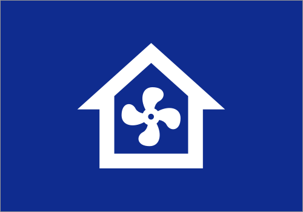

# Itho Cve Wifi - Homey App

## Overview

The **Itho Cve Wifi** app allows you to control and monitor your Itho Ventilation Unit directly from your Homey smart home platform. By connecting your Itho Ventilation Unit over WiFi, you can manage your indoor climate more efficiently and conveniently.

**Note**: The Itho Ventilation Unit requires the **WiFi Add-On Module** to be installed, which can be purchased from [NRG Watch](https://www.nrgwatch.nl/product/itho-cve-rft-wifi-add-on/).

This app has been tested only on firmware version **2.8.0** of the WiFi module.

## Features

- **Control Fan Speed**: Adjust the fan speed of your Itho Ventilation Unit directly from Homey.
- **Monitor Ventilation**: Get real-time status updates on your ventilation system.
- **Automation Support**: Integrate your Itho Ventilation Unit with Homey flows to automate ventilation based on triggers, such as humidity, temperature, or time.
- **Custom Triggers**: Use Homey to set custom triggers based on environmental sensors or time of day to automate fan speed adjustments.

## Installation

1. Install the **Itho Cve Wifi** app from the Homey app store.
2. Ensure your Itho Ventilation Unit is equipped with the **WiFi Add-On Module** and is connected to the same WiFi network as your Homey.
3. Open the Homey app and navigate to `Devices`.
4. Click on `Add Device` and select **Itho Cve Wifi** from the list.
5. Follow the on-screen instructions to pair your Itho Ventilation Unit with Homey.

## Usage

Once your Itho Ventilation Unit is connected, you can control it from the Homey app:

- **Control Panel**: Access your device via the Homey app to manually adjust fan speed.
- **Flows**: Use Homey’s Flow editor to create automations. For example:
    - Set the fan to boost mode when the humidity in the bathroom exceeds a certain level.
    - Reduce fan speed at night to minimize noise.

## Requirements

- Itho Ventilation Unit with the **WiFi Add-On Module**. You can purchase the module from [NRG Watch](https://www.nrgwatch.nl/product/itho-cve-rft-wifi-add-on/).
- Homey (with the latest firmware installed).
- WiFi Add-On Module must be on firmware version **2.8.0** (the app has only been tested on this version).

## Support

If you encounter issues or have any questions, feel free to reach out via the Homey community or open an issue on the app’s GitHub repository.

## Contributing

Feel free to contribute to the development of this app. Fork the repository and submit a pull request with your changes. Make sure to adhere to the contribution guidelines.
